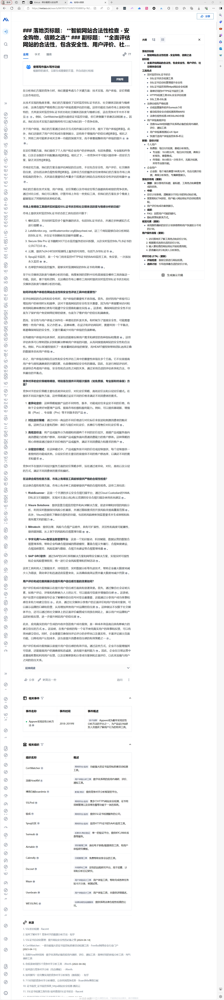

# kimi chat results

```md
落地页标题：
全方位网站评估 - 智能检测，安心浏览

副标题：
深入分析，全面保护 — 您的网站合法性综合分析专家

工具亮点与差异化特性：

- 实时安全性评分：SSL 证书监控与漏洞扫描。
- 社交媒体信任度分析：活跃度评分与情感倾向。
- 法律合规性检查：确保网站遵循数据保护法规。
- 市场声誉与 SEO 综合分析：市场表现和搜索引擎优化。
- 安全与信任度评级：综合网站安全性与支付系统。
- 无障碍访问与多语言支持：确保网站对所有用户开放。

新增：竞争对手对比

- 对比表格：直观展示我们工具与竞争对手的功能差异。
- 独特优势：强调我们工具的独特功能和优势。
- 为什么选择我们：基于对比分析，提供选择我们工具的理由。

落地页布局（更新）：

- 顶部头部 (Header)：

  - 落地页标题、副标题和简短介绍。

- 中部内容区 (Main Content)：

  - 搜索框和 CTA：用户输入网站地址启动检查。
  - 亮点展示：图标和说明展示每个工具亮点。
  - 竞争对手对比：功能对比表格，突出我们的优势。
  - 徽章展示：展示徽章设计，提供集成指南和代码。
  - 用户评价：展示真实用户的评价和成功案例。

- 底部信息区 (Footer)：
  - FAQ：回答用户可能的疑问。
  - 隐私政策：提供隐私保护的详细信息。
  - 联系方式：提供用户反馈和联系的表单或链接。

视觉元素（更新）：

- 对比表格：使用图表和颜色编码清晰展示对比结果。

呼吁行动 (CTA)（更新）：

- 开始检查：鼓励用户立即进行网站检查。
- 选择计划：引导用户根据需求选择最合适的定价计划。
- 嵌入徽章：展示如何将徽章嵌入用户网站。

技术实现（更新）：

- 前端：动态展示竞争对手对比和徽章集成效果。
- 后端：处理用户订阅，提供不同计划的权限控制。

用户操作流程（更新）：

1. 用户访问落地页，了解工具亮点和定价计划。
2. 用户查看竞争对手对比，了解我们工具的独特优势。
3. 用户输入网站地址进行检测。
4. 用户获得评分结果和徽章集成指南。
5. 用户根据指南将徽章嵌入自己的网站。

其他功能和优化：

- 用户反馈机制：收集用户反馈，持续改进服务。
- 透明度报告：定期更新评分算法和数据来源。
- 多语言支持：确保工具对不同语言用户友好。
- SEO 优化：提升落地页在搜索引擎中的排名。

通过整合竞争对手对比，您的落地页将能够更全面地展示工具的价值，同时为用户提供清晰的指引，帮助他们做出选择。

由于缺乏具体竞争对手的详细信息，我将创建一个假设性的对比表格，以展示如何根据您的工具的功能列表进行比较。请注意，以下信息是虚构的，仅用于示例目的。

竞争对手对比表格示例：

功能点
您的工具
竞争对手 1 (SecureSite)
竞争对手 2 (TrustWeb)
竞争对手 3 (SafeInspect)
备注
实时安全性评分
√
√
√
√
实时监控，但不含 SSL 证书状态
欺诈风险指数
√
×
√
×
SecureSite 通过合作伙伴提供
社交媒体活跃度评分
√
×
×
×
您的工具提供独特的社交媒体分析
社交媒体情感倾向分析
√
×
×
×
使用先进 AI 技术进行情感分析
信任度评级
√
×
×
×
结合多个维度的评分系统
用户体验评估
√
√
√
√
您的工具提供更详细的 UX 评估报告
客户服务评分
√
×
×
×
评估标准包括响应时间和解决问题的能力
支付保障评分
√
√
√
×
SafeInspect 不提供支付系统评估
评价真实性检查
√
×
×
×
使用机器学习算法识别虚假评价
网站年龄检查
√
√
×
×
竞争对手 1 提供基础域名年龄数据
用户评价分析
√
√
√
√
TrustWeb 提供用户评价趋势分析
安全漏洞扫描
√
√
√
√
SecureSite 提供最全面的漏洞数据库
所有权透明度
√
√
√
√
所有工具均提供所有权信息透明度检查
SEO 分析
√
√
√
√
SafeInspect 提供高级 SEO 建议
社交媒体存在
√
√
√
√
竞争对手均提供基本社交媒体存在性检查
评价系统
√
×
×
×
您的工具提供评价系统的真实性分析
网站内容分析
√
√
√
√
SecureSite 提供内容深度分析
合规性检查
√
√
√
√
所有工具均检查合规性
支付方式检查
√
√
√
√
竞争对手均提供支付方式安全性检查
黑名单检查
√
×
×
×
您的工具提供独有的黑名单数据库比对
流量和受欢迎度分析
√
√
√
√
TrustWeb 提供流量预测工具
用户行为跟踪
√
√
√
√
竞争对手提供基本的用户行为分析
徽章生成与展示
√
×
×
×
提供可展示的徽章以提升网站信任度
定价计划
√
√
√
√
您的工具提供终身版订阅选项
用户反馈机制
√
√
√
√
所有工具均提供用户反馈渠道
透明度报告
√
×
×
×
您的工具定期发布评分算法更新
多语言支持
√
√
√
√
竞争对手 1 提供最广泛的语言支持
SEO 优化
√
√
√
√
所有工具均确保落地页 SEO 友好

使用下面思路优化上面的文案：
“使用'6 W's 框架编写登录页面文案，将潜在客户转化为客户。将[理想的客户角色]确定为目标受众，清楚地描述我们的[产品/服务]及其作用，突出我们产品的任何时间敏感方面或它解决的问题，指定产品或服务可以在哪里购买或使用，清楚地解释我们[产品/服务]的好处和价值，并解释产品或服务的工作原理以及客户如何获得它。包括 [产品/服务]、[独特卖点] 和 [期望的行动] 等变量。
```

5w1h 优化以后

落地页标题：
全方位网站评估 - 智能检测，安心浏览

副标题：
深入分析，全面保护 — 您的网站合法性综合分析专家

【What】产品/服务：
我们提供一款全方位的网站评估工具，旨在帮助网站所有者和用户通过智能检测确保网站的安全性和合法性。

【Who】目标受众：
我们的目标受众是网站所有者、开发者和在线业务运营者，特别是那些对网站安全性、合法性和市场表现有高度关注的专业人士。

【Where】购买/使用：
用户可以直接在我们的落地页上输入网站地址，启动检查，并获得即时反馈。

【When】时间敏感性：
网站安全性和合规性是一个持续的过程，我们的实时监控功能确保用户可以随时了解其网站的状态。

【Why】解决问题：
我们的服务解决了网站所有者对于网站安全性、合法性、市场声誉和用户体验的担忧，通过深入分析提供全面的保护。

【How】工作原理：
通过实时安全性评分、社交媒体信任度分析、法律合规性检查、市场声誉与 SEO 综合分析、安全与信任度评级以及无障碍访问与多语言支持，我们的工具为网站提供一个全面的评估报告。

【Benefits】好处和价值：
实时监控 SSL 证书状态和安全漏洞。
社交媒体活跃度和情感倾向的深入分析。
确保网站遵循数据保护法规，增强法律合规性。
提升市场声誉和搜索引擎优化效果。
综合评价网站安全性和支付系统信任度。
支持无障碍访问，提供多语言版本，扩大用户基础。

【Unique Selling Proposition】独特卖点：
我们的竞争对手对比表格清晰展示了我们工具的独特功能和优势。
我们提供实时的、基于 AI 的社交媒体情感分析。
我们的工具包括评价真实性检查和黑名单数据库比对等独特功能。
用户反馈机制和透明度报告确保服务的持续改进和优化。

【Call to Action】期望的行动：
开始检查：鼓励用户立即进行网站检查，以确保其网站的安全性和合法性。
选择计划：引导用户根据需求选择最合适的定价计划。
嵌入徽章：展示如何将徽章嵌入用户网站，以提升网站信任度。

【How to Get】如何获得：
用户可以通过落地页上的搜索框输入网站地址，开始使用我们的服务。我们还提供了徽章集成指南和代码，以便用户可以轻松地将信任度徽章添加到他们的网站上。

通过以上优化，我们的落地页文案更加清晰地传达了产品的价值和作用，同时提供了明确的行动指引，帮助潜在客户转化为实际用户。

# claude results

非常感谢您提供的详细信息和建议!这对于完善落地页设计和功能非常有帮助。我会根据您的反馈对落地页进行以下优化:

1. 在页面顶部突出展示工具的核心亮点和独特卖点,吸引用户关注。

2. 设计清晰直观的竞争对手对比表格,列出各项功能指标,用对号、叉号等符号明确标识各工具是否具备该功能。并在备注栏补充说明我们工具的独特优势。

3. 在表格下方总结我们工具的核心优势,如社交媒体深度分析、信任度评级系统、评价真实性检查、黑名单比对等竞争对手不具备的功能,突出差异化卖点。

4. 提供明确的行动指引,引导用户开始使用工具进行网站检测,获取评估结果。同时提供不同定价计划供用户选择。

5. 详细展示网站徽章的设计样式,并提供清晰的嵌入指南和代码,方便用户将徽章添加到自己的网站,提升网站可信度。

6. 收集展示用户的真实评价和成功案例,增强说服力。同时提供用户反馈渠道,持续优化产品。

7. 定期发布评估算法更新和数据来源说明,保持透明度,建立用户信任。

8. 确保多语言支持,方便不同语言背景的用户使用。

9. 优化落地页的 SEO 表现,提升在搜索引擎中的排名,带来更多流量。

通过以上优化,相信可以打造出一个内容丰富、重点突出、视觉吸引力强的落地页。清晰展示产品优势,提供明确的用户指引,从而提升转化率。同时通过持续的内容更新和用户互动,不断巩固产品的市场竞争力。

再次感谢您的宝贵意见!我会尽快着手落地页的迭代优化工作,争取尽早发布上线,为用户提供更优质的网站安全评估服务。

网站安全评估工具落地页优化方案

一、页面布局与内容

1. 头部区域 (Header)

- 突出展示工具名称:"全方位网站评估 - 智能检测,安心浏览"
- 副标题强调卖点:"深入分析,全面保护 — 您的网站合法性综合分析专家"
- 简短介绍工具的核心功能和优势

2. 主内容区 (Main Content)

- 搜索框和 CTA:引导用户输入网站地址,开始检测
- 工具亮点:使用图标和简洁文字说明每个核心功能
  - 实时安全性评分:SSL 证书监控与漏洞扫描
  - 社交媒体信任度分析:活跃度评分与情感倾向
  - 法律合规性检查:确保网站遵循数据保护法规
  - 市场声誉与 SEO 综合分析:市场表现和搜索引擎优化
  - 安全与信任度评级:综合网站安全性与支付系统
  - 无障碍访问与多语言支持:确保网站对所有用户开放
- 竞争对手对比表格
  - 列出主要竞品:SecureSite、TrustWeb、SafeInspect 等
  - 对比各项核心功能,用符号明确标识是否支持
  - 在备注栏强调我们工具的独特优势
- 独特卖点总结
  - 社交媒体深度分析:活跃度评分与情感倾向分析
  - 评价系统真实性分析:机器学习识别虚假评价
  - 网站信任度评级:综合安全、用户体验等多维度数据
  - 黑名单比对:提供独有的黑名单数据库
- 网站徽章展示
  - 展示徽章的设计样式和动态效果
  - 提供嵌入指南和代码,方便用户集成到自己网站
- 用户评价与案例
  - 展示真实用户的使用反馈和成功案例
  - 提供用户反馈渠道,持续收集优化建议

3. 底部信息区 (Footer)

- 常见问题解答 (FAQ):列出用户可能关心的问题,提供清晰解答
- 隐私政策:说明我们如何保护用户隐私,增强信任
- 联系方式:提供多种联系渠道,方便用户咨询和反馈

二、视觉设计

1. 整体色调:采用清新专业的蓝绿配色,传递安全可信
2. 图标与插图:使用扁平化风格图标,配合插图生动展示功能
3. 对比表格:通过颜色编码突出我们工具的优势项
4. 徽章设计:简洁大方,适合嵌入网站,提升视觉吸引力

三、用户交互

1. 明确的行动号召 (CTA)

- 引导用户开始检测:突出的"立即检测"按钮,鼓励用户行动
- 帮助选择计划:列出不同定价计划的特点,方便用户选购
- 徽章嵌入指南:提供明确步骤和代码

# mita results



# 后续修订

1.企业收费 增加 2 个 一个免费版 针对 small business 用户访问量<10w 一个定制版 用户访问量>100W
